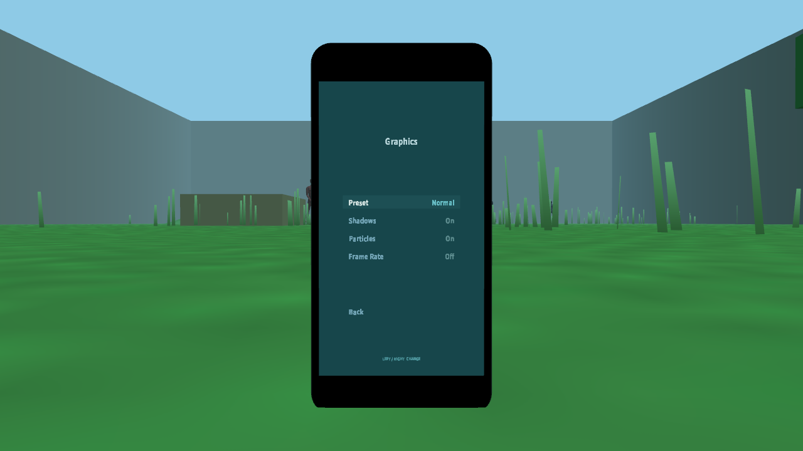

# Visual cohesion Phase A evidence

Deterministic 1280x720 menu captures from the isolated `codex/data-visual-individuality-pass` worktree.

## Audio before

The previous composition repeats page identity, uses a category-specific magenta accent, stacks a selection rail, dot, field, typography, value color, slider, and adjustment dots, and renders binary choices as continuous tracks.

## Audio after

The revised composition uses one page title with no persistent game branding or breadcrumb, gives focus to one acquisition field plus typography, keeps a track only for the continuous volume value, and presents binary choices discretely.

## Graphics after

The stepped preset is presented as a discrete choice rather than a continuous meter. Binary graphics settings use explicit `On`/`Off` values without slider geometry.

## Verification

- `cmake --build build --config Release`
- `ctest --test-dir build -C Release --output-on-failure`
- Result: 46/46 tests passed.
