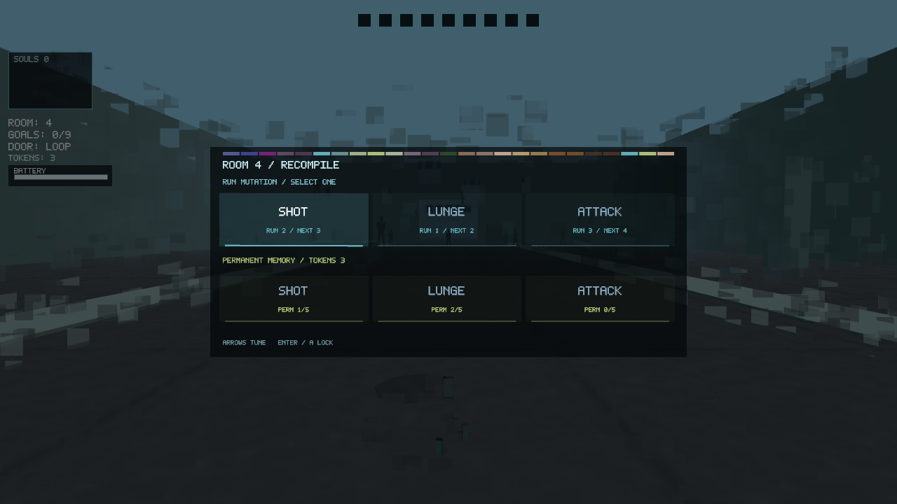

# Visual cohesion Phase B evidence

The room-completion progression surface now inherits the existing door datamosh instead of appearing as an unrelated shop overlay.

## Recompilation rule editing

The capture uses the real cached-frame transition path:

- the previous world remains visible as it breaks into sampled data cells;
- ordinary HUD telemetry recedes beneath the decision layer;
- the data mosaic becomes a stable reconstruction header;
- temporary run mutations use the active signal family and show current/next level;
- permanent memory uses the stored-data family and shows retained level and tokens;
- existing six-choice navigation, mouse regions, keyboard controls, controller controls, progression authority, and resume behavior remain unchanged.

## Verification

- deterministic `--menu-page upgrade` capture fixture;
- `RoomProgressionProbe` verifies the reveal advances while solo simulation is paused;
- `MultiplayerProtocolTest` verifies progression authority still round-trips;
- `StateLayoutContractsTest` passes;
- complete CTest suite: 46/46 passed.
