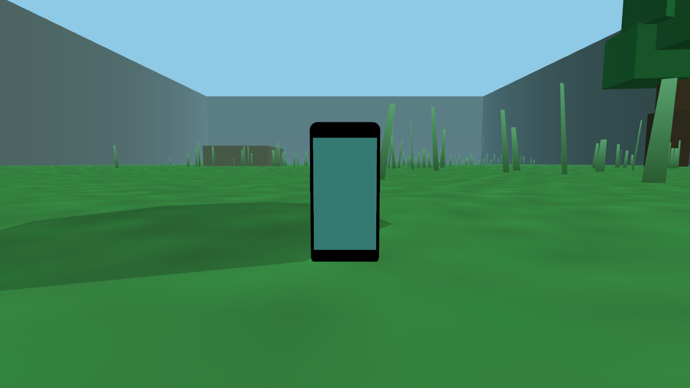
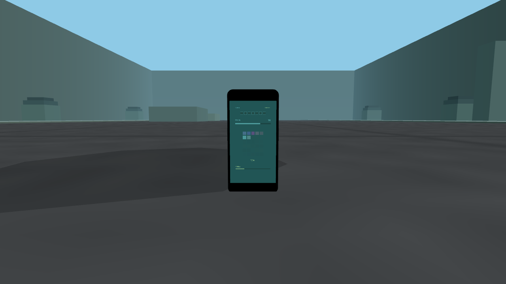

# Visual cohesion Phase C evidence

Persistent gameplay telemetry now belongs to the physical phone instead of a detached overlay.

## Before

The gameplay phone used a generic ambient display while room, goal, soul, token, battery, and power state appeared as separate HUD language.

## After

The deterministic fixture shows the same authoritative state projected onto the phone:

- room 6 and 11 tokens;
- 3 of 7 objectives;
- 67% charge;
- 7 of 30 captured souls;
- supplemental power at 25% with two flower stacks.

The display is derived at render time and does not introduce new gameplay authority. Detached persistent telemetry is removed, while reflex-critical cues remain available during live play. Actual-scale readability remains a human playtest gate before adding any explicit phone-inspection gesture.

## Verification

- `PhoneDisplayStateTest` verifies the phone projection and minimal menu-hint policy.
- `PhoneMenuLayoutTest` and `MenuNavigationTest` preserve menu layout and control behavior.
- complete Release CTest suite: 46/46 passed.
